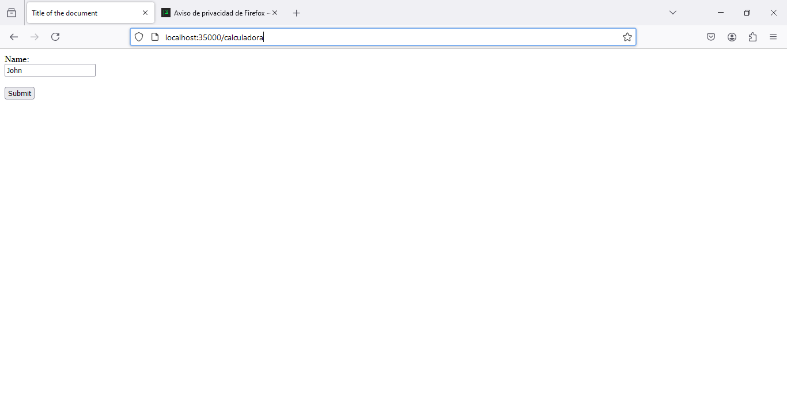

# AREP_PARCIAL_1_PRACTICO

En este parcial se realizo el servidor fachada y el http server que controlara toda la calculadora
El servidor fachada esta mostrando el html para poder ingresar y esta escucjhando por el puerto 35000

